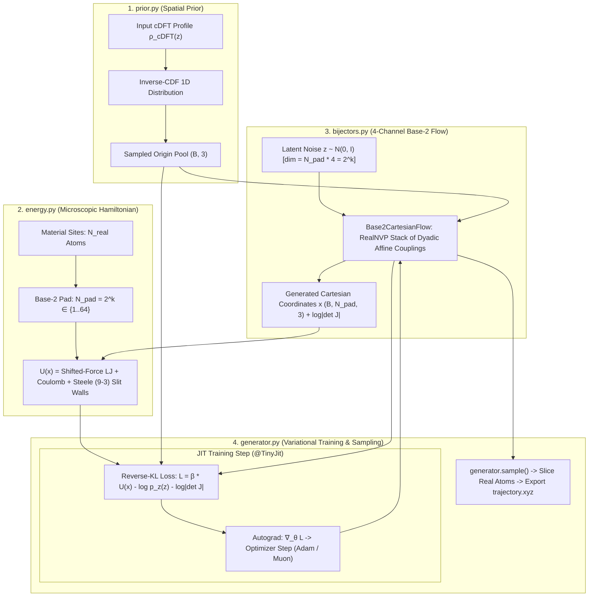

# Specification: Boltzmann Generator & Normalizing Flow Engine (`boltzman_spec.md`)

This document specifies the architecture, statistical mechanics, deep generative normalizing flows, base-2 dyadic optimization, and computational flow for the `boltzmann` subpackage within `dens-city`.

---

## 1. Domain Overview & Theoretical Bridge

### 1.1 The Generative Bridge: Mean-Field cDFT to Atomistic Sampling
While 1D/3D Classical Density Functional Theory computes the continuous single-body equilibrium density profile $\rho(\mathbf{r})$, atomistic molecular dynamics and thermodynamic validation require sampling uncorrelated many-body configurations $\mathbf{x} = (\mathbf{r}_1, \dots, \mathbf{r}_N)$ from the Boltzmann distribution:
$$p(\mathbf{x}) = \frac{1}{Z} \exp(-\beta U(\mathbf{x}))$$
where $U(\mathbf{x}) = U_{\rm pair}(\mathbf{x}) + U_{\rm wall}(\mathbf{x})$ is the exact microscopic Hamiltonian, and $\beta = 1 / (k_B T)$.

### 1.2 Variational Reverse Kullback-Leibler (KL) Training
The Boltzmann Generator uses an invertible normalizing flow $f_\theta: \mathcal{Z} \to \mathcal{X}$ mapping a base latent distribution $p_z(\mathbf{z})$ to Cartesian molecular coordinates $\mathbf{x} = f_\theta(\mathbf{z})$.
The parameters $\theta$ are optimized by minimizing the reverse KL divergence between the generated density $q_\theta(\mathbf{x})$ and the unnormalized Boltzmann target $e^{-\beta U(\mathbf{x})}$:
$$\mathcal{L}(\theta) = D_{\rm KL}(q_\theta \parallel p) = \mathbb{E}_{\mathbf{z} \sim p_z} \left[ \beta U(f_\theta(\mathbf{z})) - \log p_z(\mathbf{z}) - \log \left| \det J_{f_\theta}(\mathbf{z}) \right| \right]$$
where $\log \left| \det J_{f_\theta}(\mathbf{z}) \right|$ is the exact analytical Jacobian log-determinant accumulated across flow layers.

---

## 2. Computational Flow Architecture

---

## 3. Module Specifications & Interfaces

### 3.1 `prior.py` — cDFT Base Distribution Prior
- **`CDFTBaseDistribution`**:
  - `__init__(rho_z, l_z, box_size_xy=(30.0, 30.0), n_particles=1, n_grid=None)`: Constructs 1D cumulative distribution function (CDF) from $\rho_{\rm cDFT}(z)$.
  - `sample(n_samples=1, as_4channel=False)`: Generates configurations with uniform transverse $(x, y) \in [0, L_x] \times [0, L_y]$ and piecewise-linear inverse-CDF interpolation along $z$.
  - `log_prob(pos)`: Vectorized tinygrad tensor evaluation of exact base prior log probability:
    $$\log p_0(\mathbf{r}_1 \dots \mathbf{r}_N) = \sum_{i=1}^N \left[ -\ln(L_x L_y) + \ln(\rho_{\rm cDFT}(z_i)) - \ln\left(\int \rho_{\rm cDFT}(z) dz\right) \right]$$

### 3.2 `energy.py` — Shifted-Force Microscopic Hamiltonian & Energy Regularization
- **`regularize_energy(energy, e_high=1e4, e_max=1e20)`**:
  - Continuous logarithmic regularization $E_{\rm reg} = E_{\rm high} + \log(E - E_{\rm high} + 1)$ for $E \ge E_{\rm high}$.
  - Autograd-safe: hard-bounds excess to $0.0$ before `.log()` evaluation to prevent NaN gradient poisoning.
- **`MicroscopicEnergy`**:
  - `__init__(material, box_size, r_cut=None, pad_to_power_of_2=True, wall_type="stele93", e_high=1e4, e_max=1e20)`: Configures pairwise parameters $\sigma_{ij}, \epsilon_{ij}, q_{ij}$, minimum image periodic boundary conditions in $XY$, confining wall parameters, and Noé regularization thresholds.
  - `compute_pair_energy(pos, shift=True)`: Pairwise shifted-force Lennard-Jones (12-6) + Coulomb electrostatic energy with periodic distance wrap. Supports both $(B, N, 3)$ and $(B, N, 4)$ inputs.
  - `compute_wall_energy(pos)`: External Steele (9-3) or hard wall confining potential energy in $Z$.
  - `regularize_energy(energy, e_high=None, e_max=None)`: Regularizes high-energy configurations using instance thresholds.
  - `eval_energy`: JIT-compiled function wrapper (`TinyJit(self.__call__)`).

### 3.3 `bijectors.py` — Normalizing Flows & Invertible Bijectors
- **`AffineCouplingLayer`**:
  - Dyadic partitioning ($\text{dim}_a = \text{dim} // 2, \text{dim}_b = \text{dim} // 2$) with power-of-2 hidden dimensions.
  - Exact analytical forward, inverse, and Jacobian log-determinant $\sum s(x_A)$.
- **`RealNVPFlow`**:
  - Stacked sequence of alternating affine coupling layers.
- **`Base2CartesianFlow`**:
  - 4-channel base-2 coordinate flow $(B, N_{\rm pad}, 4)$ with flat dimension $\text{dim} = N_{\rm pad} \times 4 = 2^k \in \{4, 8, 16, 32, 64, 128, 256\}$.
  - 100% dyadic factorable matrix multiplications; eliminates serial Python unrolling loops.
- **`CompositeFlow` & `ZMatrixBijector`**:
  - Differentiable mapping between internal coordinates (bonds, angles, torsions) and 3D Cartesian coordinates via the Natural Extension Reference Frame (NeRF) algorithm.

### 3.4 `generator.py` — Variational Boltzmann Generator
- **`BoltzmannGenerator`**:
  - `__init__(flow, energy_fn, prior=None, temperature_k=300.0, learning_rate=0.01, batch_size=64)`: Initializes optimizer, device origin pool, and realized temperature buffers.
  - `compute_loss(z, origin=None)`: Evaluates Reverse-KL loss $\mathcal{L}(\theta) = \beta U(f_\theta(z)) - \log p_z(z) - \log |\det J|$.
  - `train(steps=100, batch_size=64, verbose=False)`: JIT-compiled optimization loop over flow parameters using `Adam` or `Muon`.
  - `sample(n_samples=1, return_all_pad=False)`: Draws equilibrium configurations and automatically slices dummy padding sites to return real molecular atoms $(B, N_{\rm real}, 3)$.
  - `log_prob(x)`: Evaluates exact generated density $\log q_\theta(\mathbf{x}) = \log p_z(f^{-1}(\mathbf{x})) + \log |\det J_{f^{-1}}(\mathbf{x})|$.

---

## 4. Base-2 Dyadic Optimization & Power-of-2 Architecture

To maximize GPU hardware efficiency, minimize kernel compilation overhead, and ensure seamless `@TinyJit` execution in tinygrad, the engine strictly enforces base-2 dyadic optimization across data pipelines, energy evaluators, and normalizing flows:

- **7 Power-of-2 Buckets**: All 20 materials collapse into $N_{\rm pad} \in \{1, 2, 4, 8, 16, 32, 64\}$, shrinking kernel compilation graphs to just 7 structural topologies. Arbitrary molecular topologies share identical static tensor shapes, eliminating combinatorial JIT recompilations and graph cache thrashing.
- **GPU Base-2 Matrix Alignment**: Eliminates warp loop peeling and non-aligned strides in pairwise matrix tensor reductions. Tensor operations align with warp boundaries (32/64 threads) and SIMD register lanes, achieving maximum memory bandwidth coalescing and ALU utilization.
- **Exact Observable Extraction**: Padded dummy sites have zero interactions ($\epsilon_i = 0, q_i = 0, \text{wall}_i = 0$) and are masked out via upper-triangular and atom reduction masks (`self.is_real_atom`). Generated configurations are automatically sliced back to $N_{\rm real}$ physical atoms on export (`generator.sample()`), preserving exact statistical mechanical observables.

