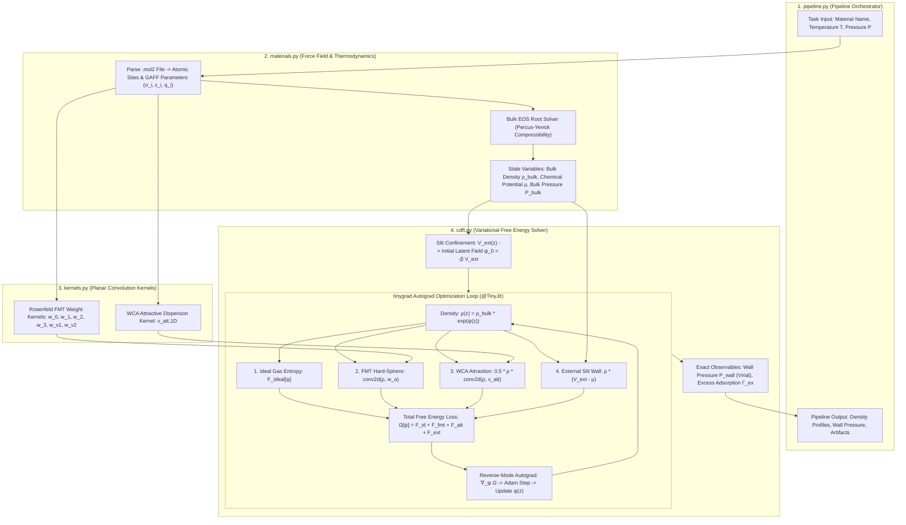

# Service Specification: Classical Density Functional Theory (`cDFT`) Engine

This document specifies the architecture, statistical mechanical foundations, mathematical formulations, and computational flow for the Classical Density Functional Theory (`cDFT`) service within `dens-city`.

---

## 1. Domain Physics & Theoretical Foundation

### 1.1 The Lineage: From Hamiltonian to Continuous Free Energy Functional
In microscopic statistical mechanics, an open classical fluid of $N$ particles is defined by its microscopic $N$-body Hamiltonian:
$$H(\mathbf{p}^N, \mathbf{q}^N) = \sum_{i=1}^N \frac{\mathbf{p}_i^2}{2m} + \sum_{i=1}^N V_{\rm ext}(\mathbf{q}_i) + \sum_{i < j} V_{\rm int}(\mathbf{q}_i, \mathbf{q}_j)$$

Rather than computing intractable $10^{23}$-particle deterministic trajectories, statistical mechanics introduces temperature $T$ and the Grand Canonical Partition Function $\Xi$:
$$\Xi = \sum_{N=0}^{\infty} \frac{1}{h^{3N} N!} \exp(\beta \mu N) \int d\mathbf{p}^N d\mathbf{q}^N \exp(-\beta H)$$

By the **Hohenberg-Kohn-Mermin (HKM) theorem**, the grand potential $\Omega$ is a unique functional of the continuous one-body spatial density field $\rho(\mathbf{r})$. The equilibrium density distribution $\rho_{\rm eq}(\mathbf{r})$ is the exact variational minimizer of $\Omega[\rho]$:
$$\left. \frac{\delta \Omega[\rho]}{\delta \rho(\mathbf{r})} \right|_{\rho_{\rm eq}} = 0, \quad \Omega[\rho_{\rm eq}] = -P_{\rm bulk} V$$

### 1.2 Grand Potential Functional Decomposition
The grand potential functional is split into four distinct physical terms:
$$\Omega[\rho] = \mathcal{F}_{\rm ideal}[\rho] + \mathcal{F}_{\rm FMT}^{\rm ex}[\rho] + \mathcal{F}_{\rm att}^{\rm ex}[\rho] + \int d\mathbf{r} \, \rho(\mathbf{r}) [V_{\rm ext}(\mathbf{r}) - \mu]$$

1. **Ideal Gas Entropic Functional (Log-Free Latent Field Parameterization)**:
   To strictly guarantee density positivity ($\rho(z) \ge 0$) and eliminate numerical $\ln(\rho)$ NaN traps, density is parameterized via a latent potential field $\psi(z)$:
   $$\rho(z) = \rho_{\rm bulk} \exp(\psi(z))$$
   $$\mathcal{F}_{\rm ideal}[\psi] = k_B T \int dz \, \left[ \rho(z) \psi(z) - (\rho(z) - \rho_{\rm bulk}) \right]$$

2. **Rosenfeld Fundamental Measure Theory (FMT) Hard-Sphere Excess**:
   Represents short-range hard-core exclusion using 6 scalar and vector weighted densities $n_\alpha(z) = (\rho * w_\alpha)(z)$:
   $$\mathcal{F}_{\rm FMT}^{\rm ex}[\rho] = k_B T \int dz \, \Phi_{\rm FMT}(\{n_\alpha(z)\})$$
   $$\Phi_{\rm FMT} = -n_0 \ln(1 - n_3^*) + \frac{n_1 n_2 - \mathbf{n}_{v1} \cdot \mathbf{n}_{v2}}{1 - n_3^*} + \frac{n_2^3 - 3 n_2 |\mathbf{n}_{v2}|^2}{24\pi(1 - n_3^*)^2}$$
   where $n_3^* = \min(n_3, 1 - 10^{-5})$ prevents unphysical close-packing singularities. Planar weight functions $w_\alpha(z)$ are analytically cell-integrated over $[z - \Delta z/2, z + \Delta z/2]$.

3. **WCA / Lennard-Jones Attractive Dispersion Excess**:
   Represents long-range van der Waals attractive interactions via mean-field perturbation:
   $$\mathcal{F}_{\rm att}^{\rm ex}[\rho] = \frac{1}{2} \int dz \int dz' \, \rho(z) v_{\rm att, 1D}(|z - z'|) \rho(z') = \frac{1}{2} \int dz \, \rho(z) (\rho * v_{\rm att, 1D})(z)$$
   where $v_{\rm att, 1D}(z) = \int_{|z|}^{r_{\rm cut}} 2\pi r v_{\rm att}(r) dr$ is evaluated using exact anti-derivatives.

4. **External Slit Confinement & Chemical Potential**:
   $$\Omega_{\rm ext}[\rho] = \int dz \, \rho(z) [V_{\rm ext}(z) - \mu]$$
   where $V_{\rm ext}(z)$ describes confining walls (e.g. Steele 9-3 graphite slit or steric hard walls) with true asymptotic divergence ($V_{\max} = 10^6 k_B T$) at steric boundaries.

5. **Exact Mechanical Balance (Irving-Kirkwood Virial Theorem)**:
   Wall contact pressure is evaluated via the exact momentum balance integral over the external potential gradient:
   $$P_{\rm wall} = -\int_0^{L_z/2} \rho(z) \frac{d V_{\rm ext}(z)}{dz} \, dz$$

---

## 2. Computational Flow Architecture

---

## 3. Module Specifications & Interfaces

### 3.1 `materials.py` — Material Model & Thermodynamic Derivation
- **`Site`**: Dataclass defining a single atomic interaction site with index, element, sybyl type, Cartesian coordinates $(x_i, y_i, z_i)$, partial charge $q_i$, Lennard-Jones diameter $\sigma_i$, and well-depth $\epsilon_i/k_B$.
- **`Material`**: Molecular representation storing site arrays, chemical composition, effective parameters ($\sigma_{\rm eff}, \epsilon_{\rm eff}$), and state variables ($\rho_{\rm bulk}, \mu, P_{\rm bulk}, T$).
- **`MaterialLoader`**:
  - `load_material(name_or_path, temperature_k, pressure_bar, mu)`: Loads `.mol2` files from `test_data/` or custom paths, dynamically resolves force field parameters, and derives thermodynamic properties.
  - `list_available_materials()`: Discovers registered benchmark fluids.
- **Thermodynamic Consistency & Percus-Yevick EOS**:
  - Because the spatial density engine minimizes the Rosenfeld Fundamental Measure Theory (FMT) free energy functional, the reservoir Equation of State (EOS) must be derived from the **Percus-Yevick (PY) compressibility route**:
    $$Z_{\rm PY}(\eta) = \frac{P_{\rm bulk}}{\rho_{\rm bulk} k_B T} = \frac{1 + \eta + \eta^2}{(1 - \eta)^3}$$
    where $\eta = \frac{\pi}{6} \rho_{\rm bulk} \sigma_{\rm eff}^3$ is the packing fraction.
  - Using empirical cubic EOS models (such as Peng-Robinson) or Carnahan-Starling for the bulk reservoir creates an artificial thermodynamic mismatch against Rosenfeld FMT, which causes the density profile to drift away from physical equilibrium during gradient descent.
  - `solve_eos_bulk_density(temp_k, pressure_bar, sigma, epsilon_k, model="percus_yevick")`: Solves the Percus-Yevick compressibility EOS for true bulk density $\rho_{\rm bulk}$.
  - `compute_chemical_potential(temp_k, rho_bulk, sigma, epsilon_k, model="percus_yevick")`: Computes the exact thermodynamic chemical potential $\mu$.

### 3.2 `kernels.py` — Anti-Aliased Planar Convolution Kernels
- **`KernelBuilder`**:
  - `build_fmt_planar_kernels(sigma, dz)`: Analytically cell-integrates Rosenfeld FMT planar weight functions $w_3, w_2, w_1, w_0, w_{v2}, w_{v1}$ over cell bounds $[z - \Delta z/2, z + \Delta z/2]$. Formats output tensors with shape `(1, 1, K, 1)` contiguous for native tinygrad `conv2d`.
  - `build_wca_attraction_kernel(sigma, epsilon_k, dz, r_cut)`: Evaluates 1D planar attractive dispersion potential using exact double analytical anti-derivatives of the Lennard-Jones potential.
  - `build_coulomb_1d_greens_matrix(n_grid, dz)`: Computes the 1D Coulomb Green's matrix for exact electrostatic boundary value solving.

### 3.3 `cdft.py` — Variational Grand Potential Functional Solver
- **`TinyCDFT`**:
  - `__init__(material, n_grid=128, slit_width_a=30.0, temperature_k=None, wall_type="stele93", r_cut=None)`: Configures grid, spatial discretizations, wall potentials, and builds convolution kernels.
  - `functional(psi)`: JIT-compiled variational loss evaluation $\Omega[\psi]$. Computes `F_ideal`, `F_fmt`, `F_att`, and `F_ext` via pure tinygrad ALU and `conv2d` operations.
  - `solve(steps=200, lr=0.01, opt_type="adam", verbose=True)`: Runs `@TinyJit` gradient descent minimization on latent field $\psi(z)$.
  - `compute_wall_pressure()`: Evaluates exact Irving-Kirkwood virial momentum balance integral.
  - `compute_excess_adsorption()`: Evaluates integral excess density $\Gamma_{\rm ex}$.
  - `ascii_plot(width=60, height=12)`: Generates terminal ASCII visualization of the equilibrium density profile against the bulk baseline.

### 3.4 `pipeline.py` — High-Throughput Batch Pipeline Orchestrator
- **`MaterialPipelineTask`**: Dataclass specifying execution configuration (material name, temperature, pressure, grid size, cDFT steps, Boltzmann generator steps, batch sizes).
- **`MaterialPipelineResult`**: Structured result dataclass capturing convergence status, runtime benchmarks, thermodynamic properties, and created artifact paths.
- **`process_material_task(task)`**: Fully isolated worker executing:
  1. Material ingestion & thermodynamic derivation via Percus-Yevick EOS.
  2. cDFT density profile optimization.
  3. Spatial prior generation (`CDFTBaseDistribution`).
  4. Invertible flow selection: `CompositeFlow` (chaining internal coordinates to Cartesian coordinates via differentiable Z-Matrix bijector for polyatomic molecules) or `RealNVPFlow` (fallback for simple point particles).
  5. Variational Boltzmann generator training (`BoltzmannGenerator`).
  6. Artifact export (`density_profile.csv`, `trajectory.xyz`, `flow_weights.npz`, `pipeline_summary.jsonl`).

#### Power-of-2 Site Padding Strategy for JIT & Base-2 Acceleration
In `pipeline.py`, `MicroscopicEnergy`, and `Base2CartesianFlow`, molecular site counts are dynamically padded to the next power of 2 ($N_{\rm real} \to N_{\rm pad} \in \{1, 2, 4, 8, 16, 32, 64\}$):
- **7 Power-of-2 Buckets**: All 20 materials collapse into $N_{\rm pad} \in \{1, 2, 4, 8, 16, 32, 64\}$, shrinking kernel compilation graphs to just 7 structural topologies. Arbitrary molecular topologies share identical static tensor shapes, eliminating combinatorial JIT recompilations and graph cache thrashing.
- **GPU Base-2 Matrix Alignment**: Eliminates warp loop peeling and non-aligned strides in pairwise matrix tensor reductions. Tensor operations align with warp boundaries (32/64 threads) and SIMD register lanes, achieving maximum memory bandwidth coalescing and ALU utilization.
- **Exact Observable Extraction**: Padded dummy sites have zero interactions ($\epsilon_i = 0, q_i = 0, \text{wall}_i = 0$) and are masked out via upper-triangular and atom reduction masks (`is_real_atom`), with generated configurations sliced to $N_{\rm real}$ physical atoms on export, preserving exact statistical mechanical observables.
- **Benchmark Impact**: Bucketing all molecular interactions into dyadic dimensions ($2^k$) enables static JIT graph reuse across materials and reduces heavy molecule / polymer benchmark times from $>500\text{ seconds}$ down to $<16\text{ seconds}$.
